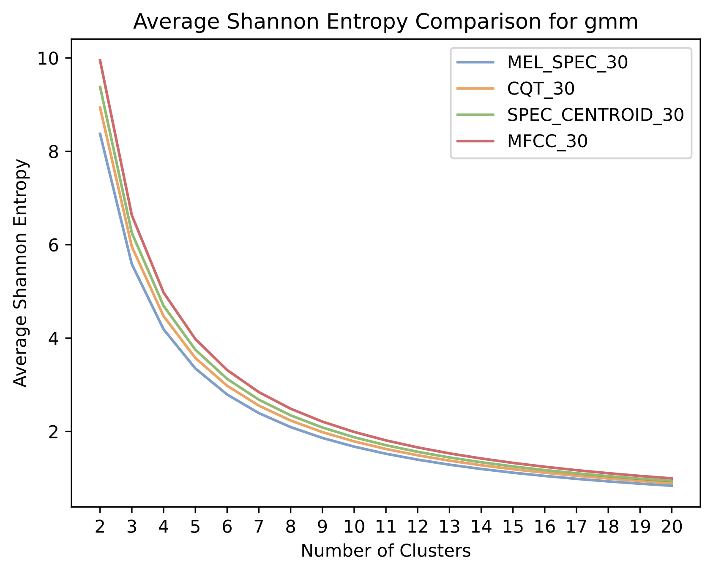

# Music Genre Analysis with Machine Learning

## The `config.yml` File
This file contains any configuration settings for preprocessing and clustering.
```yml
dataset: "/path/to/dataset"
output: "/output/directory"
preprocessor_config:
  target_length: target_length_of_all_songs_int
  segment_duration: the_snippet_length_of_each_song_int
  train_split: float_val_between_0_1
```

## Dataset Directory
The input dataset should be structure in the following way. A root directory containing a list of subdirectories named as the genre name with a series of `mp3` or `wav` files in them.
This project uses the `GTZAN` dataset [[1]](#1).

```
dataset/
├─ genre_1/
│  ├─ song_1.mp3
│  ├─ song_2.mp3
├─ genre_2/
├─ genre_.../
├─ genre_n/
```

# Preprocessing
# Clustering
This project implements K-Means and a Gaussian Mixture Model (GMM) to cluster a preprocessed dataset.

```pycon
python mgat_clustering.py -c config.yml -u abcde -t [kmeans|gmm] -n 10 -g all
```
- `-t` type of clustering model: `kmeans` or `gmm`
- `-n` the number of clusters
- `-g` which genres to cluster (`all` for all genres, or a comma seperated list of the genres)

# Convex Clustering

The following function is used to optimise the cluster centres and build a hierarchy path as inspired from [[2]](#2).
$$f_{\lambda}(U)=\frac{1}{2} \sum_{i=1}^{n}||u_i-x_i||^{2}+\lambda \sum_{i < j}W_{i,j}||u_i-u_j||$$

```pycon
python mgat_convex_clustering.py -c config.yml -u abcde -k 10 -l 15
```
- `-k` $k$ nearest neighbours when $W$ weight matrix is created
- `-l` $\lambda$ value

# Latent Space Analysis
## 1.) Shortest Path
```pycon
python mgat_clustering.py -c config.yml -u abcde -t [kmeans|gmm] -n 10 -g all -p
```
- `-t` type of clustering model: `kmeans` or `gmm`
- `-n` the number of clusters
- `-g` which genres to cluster (`all` for all genres, or a comma seperated list of the genres)
- `-p` shortest path between two randomly initialised points


## 2.) Song Recommendation
```pycon
python mgat_clustering.py -c config.yml -u abcde -t [kmeans|gmm] -n 10 -g all
```
- `-t` type of clustering model: `kmeans` or `gmm`
- `-n` the number of clusters
- `-g` which genres to cluster (`all` for all genres, or a comma seperated list of the genres)

Click on a point in the latent space to see its nearest neighbours (defaulted to 5)


## 3.) Song Genre Evolution

# Performance

<div style="display: flex; align-items: center;">
  
  <p style="margin-left: 10px;"></p>p>
  <p style="margin-left: 10px;">There is a trade-off between not mixing too many genres (low Shannon entropy) and not fragmenting the dataset into too many granular and specialised genres. Although just past the elbow of the curve, the curve shows that 7 clusters, when using all 10 genres, prioritises genre fragmentation, whilst still yielding a low Shannon entropy.</p>
</div>

---
# References
<a id="2">[1]</a>  
Olteanu, A. (n.d.).  
GTZAN Dataset - Music Genre Classification.  
Retrieved from [Kaggle](https://www.kaggle.com/datasets/andradaolteanu/gtzan-dataset-music-genre-classification).

<a id="1">[2]</a>  
Chen, G., Chi, E., Ranola, J., & Lange, K. (2014).  
Convex clustering: An attractive alternative to hierarchical clustering.  
*PLoS Computational Biology, 11*, e1004228.  
[https://doi.org/10.1371/journal.pcbi.1004228](https://doi.org/10.1371/journal.pcbi.1004228)