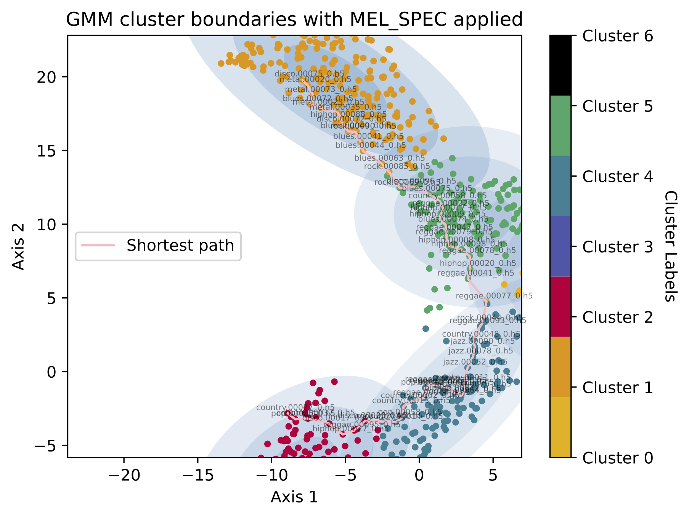
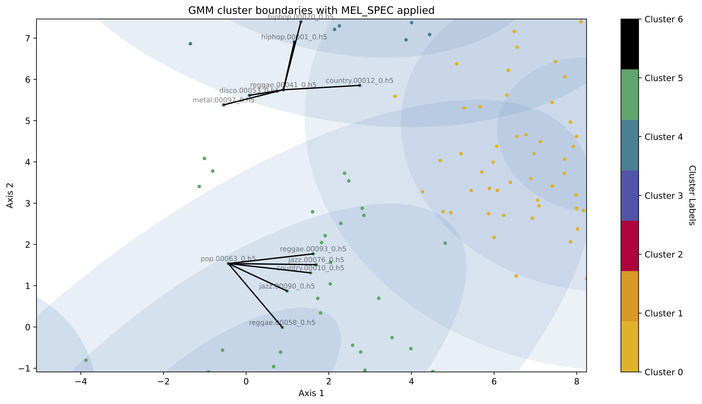
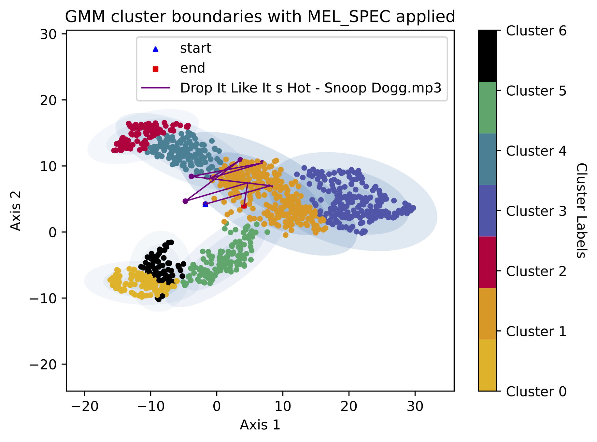

# 🚀 Music Genre Analysis with Machine Learning 🚀
- Music genre analysis is typically treated as a multi-classification problem. With the influx in the number of modern day genres, multi-classification networks struggle to generalise to lots of classes and the subjective nature of what defines a genre may mean a song could belong into two or more genres.
- This research proposes the use of **unsupervised machine learning** methods to partially get rid of the reliance for predetermined labels and instead let the clustering define the genres and like songs. 
- Clustering the latent space allows for such applications like **song recommendation**, plotting the **song evolution**, and understanding the intricate **local structures of a sound space**.

This project uses **UMAP** to reduce the dimensions of the transformed songs into 2 Dimensions with a choice of three models: K-Means, a Gaussian Mixture Model (GMM), and a Convex Clustering algorithm, that can be applied to the latent space.
Its noted that using a GMM better represents the latent space due to the soft assignments given to each point plus the covariance structure produces better song recommendations.
The convex clustering algorithm creates a hierarchical structure of the song data points.

## ⚙️ The Config File ⚙️
A `config.yml` contains any configuration settings for preprocessing and clustering.
```yml
dataset: "/path/to/dataset"
output: "/output/directory"
preprocessor_config:
  target_length: target_length_of_all_songs_int
  segment_duration: the_snippet_length_of_each_song_int
  train_split: float_val_between_0_1
```

## 🗄️ Dataset Directory 🗄️
The input dataset should be structure in the following way. A root directory containing a list of subdirectories named as the genre name with a series of `mp3` or `wav` files in them.
This project uses the `GTZAN` dataset [[1]](#1).

```
dataset/
├─ genre_1/
│  ├─ song_1.mp3
│  ├─ song_2.mp3
├─ genre_2/
├─ genre_.../
├─ genre_n/
```

## 🪄 Preprocessing 🪄
Preprocess the dataset to set a target length and snippet length with a choice of: `MEL_SPEC`, `CQT`, `MFCC`, and `SPEC_CENTROID`

```pycon
python mgat_preprocessor.py -c config.yml -s MEL_SPEC
```
- `-s` type of signal transformer: `MEL_SPEC`, `CQT`, `MFCC`, and `SPEC_CENTROID`

This will create a unique directory in the output path specified in `config.yml` use this uuid when specifying the `-u` flag

## ✨ Clustering ✨
This project implements K-Means and a Gaussian Mixture Model (GMM) to cluster a preprocessed dataset.

```pycon
python mgat_clustering.py -c config.yml -u abcde -t [kmeans|gmm] -n 10 -g all
```
- `-t` type of clustering model: `kmeans` or `gmm`
- `-n` the number of clusters
- `-g` which genres to cluster (`all` for all genres, or a comma seperated list of the genres)

## ✨Convex Clustering ✨

The following function is used to optimise the cluster centres and build a hierarchy path as inspired from [[2]](#2).
$$f_{\lambda}(U)=\frac{1}{2} \sum_{i=1}^{n}||u_i-x_i||^{2}+\lambda \sum_{i < j}W_{i,j}||u_i-u_j||$$

```pycon
python mgat_convex_clustering.py -c config.yml -u abcde -k 10 -l 15
```
- `-k` $k$ nearest neighbours when $W$ weight matrix is created
- `-l` $\lambda$ value

## 🎶Latent Space Analysis 🎶
|  |  |  |
|-------------------------------------------------------------|----------------------------------------------------------|-----------------------------------------------------|
| _Shortest path using a gaussian mixture model_              | _Song recommendation using a gaussian mixture model_     | _Song evolution using a gaussian mixture model_     |

### 1.) Shortest Path
```pycon
python mgat_clustering.py -c config.yml -u abcde -t [kmeans|gmm] -n 10 -g all -p
```
- `-t` type of clustering model: `kmeans` or `gmm`
- `-n` the number of clusters
- `-g` which genres to cluster (`all` for all genres, or a comma seperated list of the genres)
- `-p` shortest path between two randomly initialised points

### 2.) Song Recommendation
```pycon
python mgat_clustering.py -c config.yml -u abcde -t [kmeans|gmm] -n 10 -g all
```
- `-t` type of clustering model: `kmeans` or `gmm`
- `-n` the number of clusters
- `-g` which genres to cluster (`all` for all genres, or a comma seperated list of the genres)

**Click on a point in the latent space to see its nearest neighbours (defaulted to 5)**

### 3.) Song Genre Evolution
```pycon
python mgat_clustering.py -c config.yml -u abcde -t [kmeans|gmm] -n 10 -g all -f path/to/song
```
- `-t` type of clustering model: `kmeans` or `gmm`
- `-n` the number of clusters
- `-g` which genres to cluster (`all` for all genres, or a comma seperated list of the genres)
- `-f` path to mp3 file of new song to plot

---
# References
<a id="2">[1]</a>  
Olteanu, A. (n.d.).  
GTZAN Dataset - Music Genre Classification.  
Retrieved from [Kaggle](https://www.kaggle.com/datasets/andradaolteanu/gtzan-dataset-music-genre-classification).

<a id="1">[2]</a>  
Chen, G., Chi, E., Ranola, J., & Lange, K. (2014).  
Convex clustering: An attractive alternative to hierarchical clustering.  
*PLoS Computational Biology, 11*, e1004228.  
[https://doi.org/10.1371/journal.pcbi.1004228](https://doi.org/10.1371/journal.pcbi.1004228)