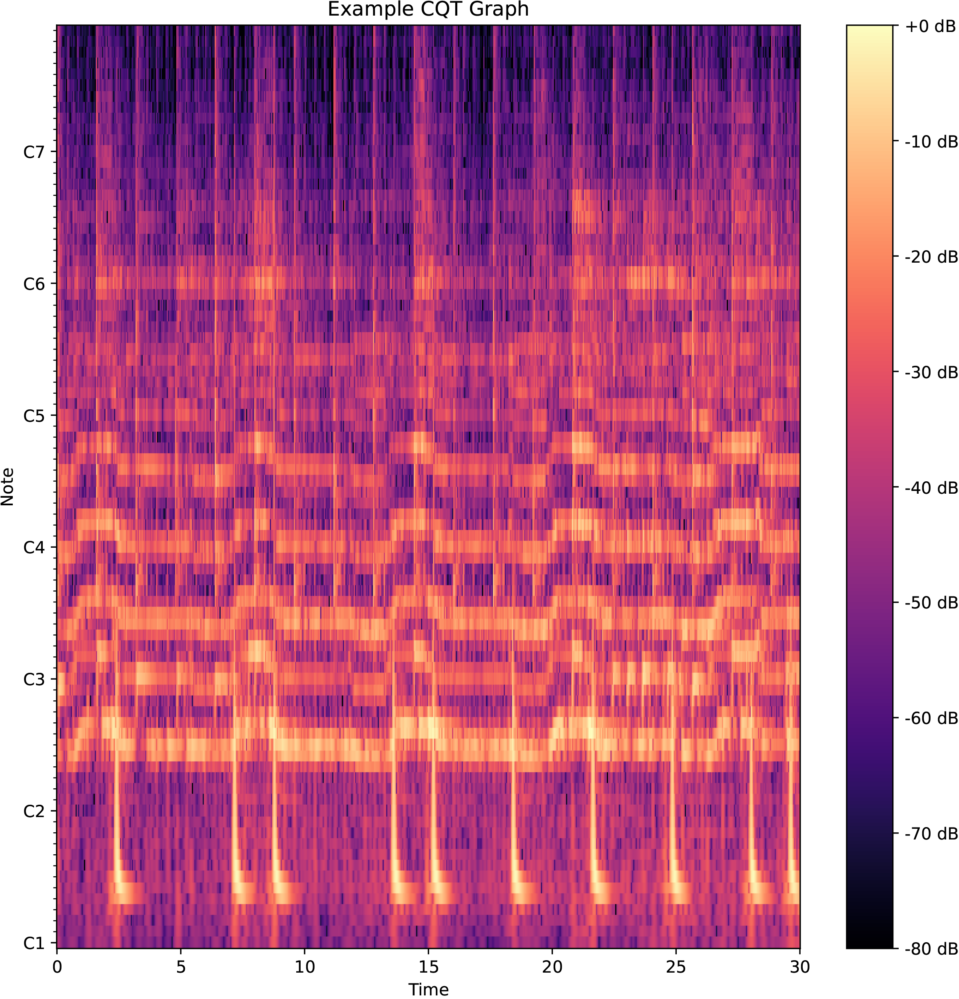
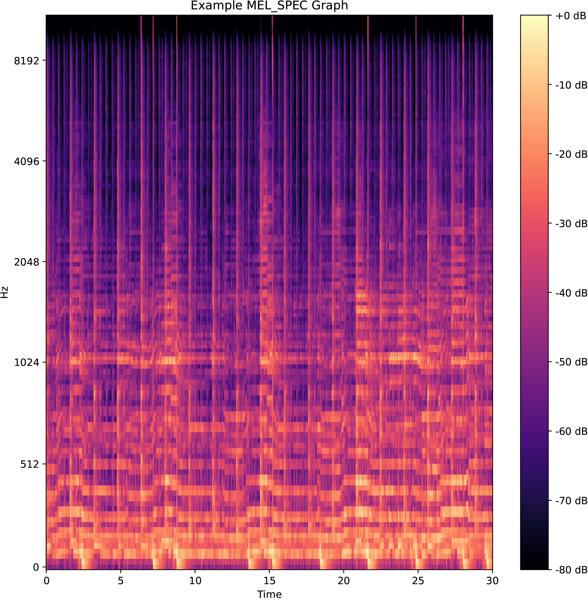
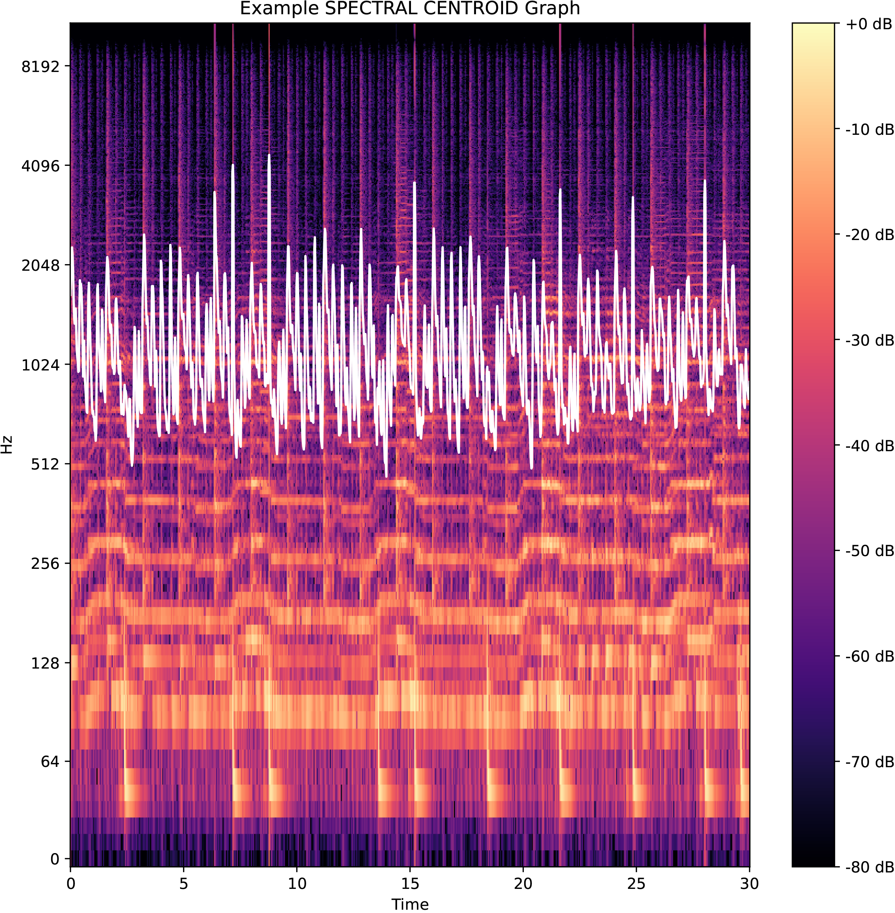
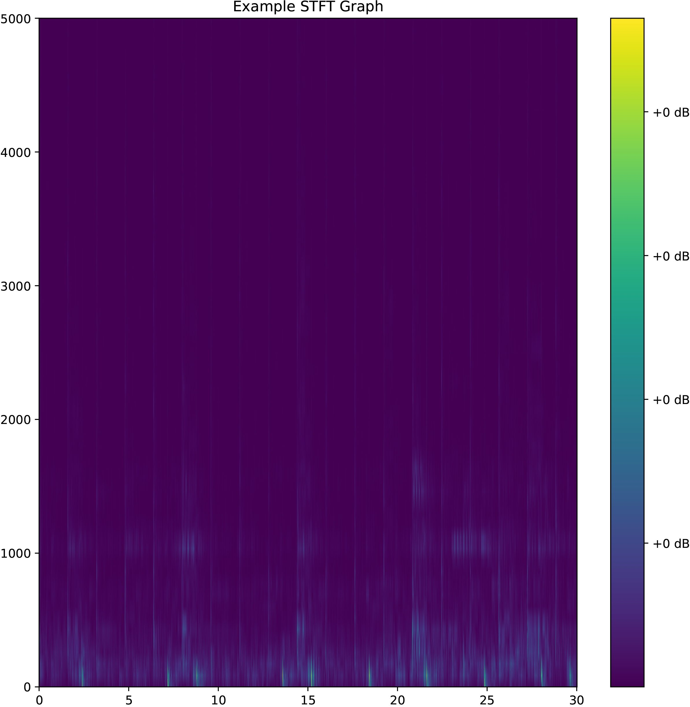

# Music Analysis with Machine Learning

## Music Analysis Tool (MAT) - **Preprocessing**
This is responsible for preprocessing a dataset ready for processing. For preprocessing options, run:

```pycon
python mat_preprocessor.py --help
```

alternatively see below:

```pycon    
usage: Music Analysis Tool (MAT) - PREPROCESSOR [-h] -c CONFIG -s {CQT,STFT,MEL_SPEC,SPEC_CENTROID} [{CQT,STFT,MEL_SPEC,SPEC_CENTROID} ...] [-p] [-f FIGURES]

Preprocess Audio Dataset

options:
  -h, --help            show this help message and exit
  -c CONFIG, --config CONFIG
                        config file
  -s {CQT,STFT,MEL_SPEC,SPEC_CENTROID} [{CQT,STFT,MEL_SPEC,SPEC_CENTROID} ...], --signal_processors {CQT,STFT,MEL_SPEC,SPEC_CENTROID} [{CQT,STFT,MEL_SPEC,SPEC_CENTROID} ...]
                        the signal processors to apply to the raw audio
  -p, --process         preprocesses data the data use the parameters set in the config file
  -f FIGURES, --figures FIGURES
                        create a set of n example figures
```

## The `config.yml` File
This file contains any configuration settings for preprocessing and training a model.
```yml
dataset: "/path/to/dataset"
output: "/output/directory"
preprocessor_config:
  target_length: target_length_of_all_songs_int
  segment_duration: the_snippet_length_of_each_song_int
  train_split: float_val_between_0_1
```

### Dataset Directory
The input dataset should be structure in the following way.
```
dataset/
├─ genre_1/
│  ├─ song_1.mp3
│  ├─ song_2.mp3
├─ genre_2/
├─ genre_.../
├─ genre_n/
```
A root directory containing a list of subdirectories named as the genre name with a series of `mp3` or `wav` files in them.
This project primarily uses the `GTZAN` dataset, which can be downloaded [here](https://www.kaggle.com/datasets/andradaolteanu/gtzan-dataset-music-genre-classification).

### Spectrographs
Below demonstrates the possible spectrographs that can be generated in the preprocessing pipeline
#### CQT example Figure

#### Mel Spectrogram Example Figure

#### Spectral Centroid Example Figure

#### Short-time Fourier Transform Example Figure


